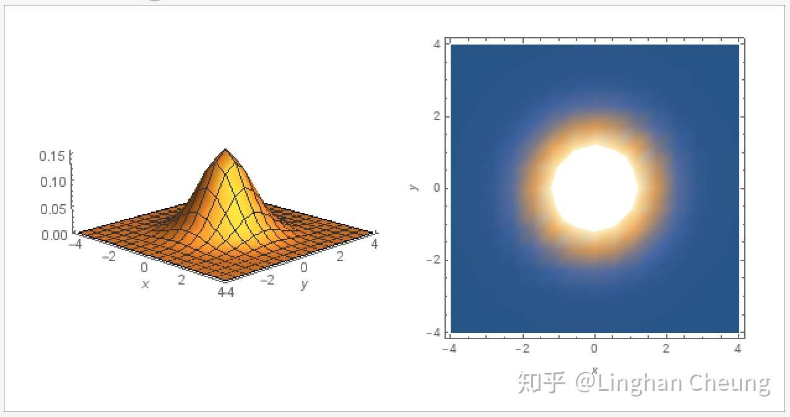

转载自[知乎](https://zhuanlan.zhihu.com/p/58987388 "多元高斯分布详解")

## Multivariate Gaussian Distribution
> 由中心极限定理我们知道，大量独立同分布的随机变量的均值在做适当标准化后会依分布收敛于高斯分布，这使得高斯分布具有普适性的建模能力.
> 数学上，当使用高斯分布对贝叶斯推断的似然和先验进行建模时，得到的后验同样为高斯分布，即其具有共轭先验性质.

### 多元标准高斯分布
#### 一元高斯分布
若随机变量 $X \sim \mathcal{N}(\mu, \sigma^2)$ ，则有如下的概率密度函数
$$
\begin{align}
p(x) = \frac{1}{\sqrt{2\pi}\sigma} e^{-\frac{1}{2}(\frac{x-\mu}{\sigma})^2} \tag{1}
\end{align}
$$

$$
\begin{align}
1 = \int_{-\infty}^{\infty}{p(x)dx} \tag{2}
\end{align}
$$

而如果我们对随机变量 $X$ 进行标准化，使用 $Z = \frac{x - \mu}{\sigma}$ 对 (1) 进行换元，继而有
$$
\begin{align}
\because\ x(z) = z \cdot \sigma + \mu
\end{align}
$$

$$
\begin{align}
\therefore\ p(x(z)) = \frac{1}{\sqrt{2\pi}\sigma} e^{-\frac{1}{2}z^2}
\end{align}
$$

$$
\begin{align}
\therefore\ 1\ = \int_{-\infty}^{\infty}{p(x(z))dx}
\end{align}
$$

$$
\begin{align}
\qquad \qquad  = \int_{-\infty}^{\infty}{\frac{1}{\sqrt{2\pi}\sigma} e^{-\frac{1}{2}z^2} dx}
\end{align}
$$

$$
\begin{align}
\qquad \quad\\\  = \int_{-\infty}^{\infty}{\frac{1}{\sqrt{2\pi}} e^{-\frac{1}{2}z^2} dz} \tag{3}
\end{align}
$$

此时我们说随机变量 $Z \sim \mathcal{N}(0,1)$ 服从一元标准高斯分布，其均值 $\mu = 0$，方差 $\sigma^2 = 1$，其概率密度函数为

$$
\begin{align}
p(z) = \frac{1}{\sqrt{2\pi}} e^{-\frac{1}{2}z^2} \tag{4}
\end{align}
$$

**随机变量** $X$ **标准化的过程，实际上是消除量纲影响和分布差异的过程。
通过将随机变量的值减去其均值再除以标准差，使得随机变量与其均值的差距可以用若干个标准差来衡量，从而实现了不同随机变量与其对应均值的差距
可以以一种相对的距离来比较。**

#### 多元标准高斯分布
那么一元标准高斯分布与多元标准高斯分布有什么关系呢？事实上，多元标准高斯分布的概率密度函数正式从式(4)中导出的。
假设我们有随机向量 $\overrightarrow{Z} = [Z_1, \cdots, Z_n]^T$，其中 $Z_i \sim \mathcal{N}(0,1)\ (i=1, \cdots, n)$
且 $Z_i, Z_j\ (i,j=1, \cdots, n,\ i \neq j)$ 彼此独立，即随机向量中的每个随机变量 $Z_i$ 都服从标准高斯分布且两两彼此独立，
则由(4)与独立变量概率密度函数之间的关系，我们可以得到随机向量 $\overrightarrow{Z} = [Z_1, \cdots, Z_n]^T$ 的联合概率密度函数为

$$
\begin{align}
p(z_1, \cdots, z_n) = \prod_{i=1}^{n} \frac{1}{\sqrt{2\pi}} e^{-\frac{1}{2}(z_i)^2}
\end{align}
$$

$$
\begin{align}
\qquad \qquad = \frac{1}{(2\pi)^{\frac{n}{2}}} e^{-\frac{1}{2}(Z^{T}Z)}
\end{align}
$$

$$
\begin{align}
1 = \int_{-\infty}^{\infty} \cdots \int_{-\infty}^{\infty} p(z_1, \cdots, z_n) dz_1 \cdots dz_n \tag{5}
\end{align}
$$

我们称随机向量 $\overrightarrow{Z} \sim \mathcal{N}(\overrightarrow{0}, \boldsymbol{I})$，即随机向量服从均值为零向量，协方差矩阵为单位矩阵的高斯分布。
在这里，随机向量 $\overrightarrow{Z}$ 的协方差矩阵是 $Conv(Z_i, Z_j), i,j = 1, \cdots, n$ 组成的矩阵，即

$$
\begin{align}
[Conv(Z_i, Z_j)]_{n \times n} = E[(Z - \overrightarrow{\mu})(Z - \overrightarrow{\mu})^T] = \boldsymbol{I} \tag{6}
\end{align}
$$

由于随机向量 $\overrightarrow{Z}$，所以其协方差矩阵的对角线元素为1，其余元素为0.
如果我们取常数 $c = p(z_1, \cdots, z_n)$，则可得函数 $p(z_1, \cdots, z_n)$ 的等高线为 $c' = Z^T Z$，当随机变量 $\overrightarrow{Z}$ 为二维向量时，
我们有

$$
\begin{align}
c' = Z^T \cdot Z = (z_1 - 0)^2 + (z_2 - 0)^2 \tag{7}
\end{align}
$$

由(7)可知，其等高线为以(0,0)为圆心的同心圆。

 二次标准高斯分布概率密度函数图 

### 多元高斯分布
我们知道，当随机变量 $\overrightarrow{Z} \sim \mathcal{N}(\overrightarrow{0}, \boldsymbol{I})$ 时，
其每个随机变量 $Z_i \sim \mathcal{N}(0,1)\ (i = 1, \cdots, n)$ 彼此独立，我们可通过式(4)与独立随机变量概率密度函数之间的关系得出其联合概率密度函数（式5）。
那么，对于一般的随机变量 $\overrightarrow{X} \sim \mathcal{N}(\overrightarrow{\mu}, \sum)$，
即其每个随机变量 $X_i \sim \mathcal{N}(\mu_i, \sigma_i^2)\ (i = 1, \cdots, n)$ 且 $X_i, X_j\ (i, j = 1, \cdots, n)$ 彼此不独立的情况下，
我们该如何求随机向量 $\overrightarrow{X}$ 的联合概率密度函数呢？
一个很自然的想法是，**如果我们能够通过线性变换，使得随机向量** $\overrightarrow{X} = [X_1, \cdots, X_n]^T$ **中的每个随机变量彼此独立，
则我们也可以通过独立随机变量概率密度函数之间的关系求出其联合概率密度函数。**
事实上，我们有定理：
> 定理：若存在随机向量 $\overrightarrow{X} \sim \mathcal{N}(\overrightarrow{\mu}, \sum)$，其中 $\overrightarrow{\mu} \in \mathbb{R}^n$ 为均值向量，
> $\sum \in S_{++}^{n \times n}$ 半正定实对称矩阵为 $\overrightarrow{X}$ 的协方差矩阵，则存在满秩矩阵 $B \in \mathbb{R}^{n \times n}$，
> 使得 $\overrightarrow{Z} = B^{-1}(\overrightarrow{X} - \overrightarrow{\mu})$，
> 而 $\overrightarrow{Z} \sim \mathcal{N}(\overrightarrow{0}, \boldsymbol{I})$.

有了定理1，我们就可以对随机向量 $\overrightarrow{X}$ 做相应的线性变换，使得随机变量在线性变换后彼此独立，从而求出其联合概率密度函数，具体地

$$
\begin{align}
\because\ \overrightarrow{Z} = B^{-1} (\overrightarrow{X} - \overrightarrow{\mu}), \overrightarrow{Z} \sim \mathcal{N}(\overrightarrow{0}, \boldsymbol{I}) \tag{8}
\end{align}
$$

$$
\begin{align}
\therefore\ p(Z_1, \cdots, z_n) = \frac{1}{(2\pi)^{\frac{n}{2}}} e^{-\frac{1}{2}(Z^T Z)}
\end{align}
$$

$$
\begin{align}
p(Z_1(x_1, \cdots, x_n), \cdots) = \frac{1}{(2\pi)^{\frac{n}{2}}} e^{-\frac{1}{2}[(B^{-1}(\overrightarrow{X} - \overrightarrow{\mu}))^T(B^{-1}(\overrightarrow{X} - \overrightarrow{\mu}))]}
\end{align}
$$

$$
\begin{align}
\qquad \qquad = \frac{1}{(2\pi)^{\frac{n}{2}}} e^{-\frac{1}{2}[((\overrightarrow{X} - \overrightarrow{\mu}))^T(BB^T)^{-1}((\overrightarrow{X} - \overrightarrow{\mu}))]}
\end{align}
$$

$$
\begin{align}
\therefore\ 1 = \int_{\infty}^{\infty}  \cdots \int_{\infty}^{\infty} p(z_1(x_1, \cdots, x_n), \cdots) dz_1 \cdots dz_n
\end{align}
$$

$$
\begin{align}
= \int_{\infty}^{\infty}  \cdots \int_{\infty}^{\infty} \frac{1}{(2\pi)^{\frac{n}{2}}} e^{-\frac{1}{2}[(\overrightarrow{X} - \overrightarrow{\mu})^T(BB^T)^{-1}(\overrightarrow{X} - \overrightarrow{\mu})]} dz_1 \cdots dz_n \tag{9}
\end{align}
$$

由多元函数换元变换公式，我们还需要求出雅可比行列式 $J(\overrightarrow{Z} \rightarrow \overrightarrow{X})$，由(8)可得

$$
\begin{align}
J(\overrightarrow{Z} \rightarrow \overrightarrow{X}) = |B^{-1}| = |B|^{-1} = |B|^{-\frac{1}{2}} \cdot |B^T|^{-\frac{1}{2}} = |BB^T|^{-\frac{1}{2}} \tag{10}
\end{align}
$$

由(9)(10)，我们可进一步得

$$
\begin{align}
1 = \int_{-\infty}^{\infty} \cdots \int_{-\infty}^{\infty} \frac{1}{(2\pi)^{\frac{n}{2}}|BB^T|^{\frac{1}{2}}} e^{-\frac{1}{2}[(\overrightarrow{X} - \overrightarrow{\mu})^T(BB^T)(\overrightarrow{X} - \overrightarrow{\mu})]} dx_1 \cdots dx_n \tag{11}
\end{align}
$$

我们得到随机向量 $\overrightarrow{X} \sim \mathcal{N}(\overrightarrow{\mu}, \sum)$ 的联合概率密度函数为

$$
\begin{align}
p(x_1, \cdots, x_n) = \frac{1}{(2\pi)^{\frac{n}{2}}|BB^T|^{\frac{1}{2}}} e^{-\frac{1}{2}|BB^T|^{\frac{1}{2}}} e^{-\frac{1}{2}[(\overrightarrow{X} - \overrightarrow{\mu})^T(BB^T)(\overrightarrow{X} - \overrightarrow{\mu})]} \tag{12}
\end{align}
$$

在(12)中，随机向量 $\overrightarrow{X}$ 的协方差矩阵还未得到体现，我们可通过线性变换(8)做进一步处理

$$
\begin{align}
\sum = \boldsymbol{E} [(\overrightarrow{X} - \overrightarrow{\mu})(\overrightarrow{X} - \overrightarrow{\mu})^T]
\end{align}
$$

$$
\begin{align}
\qquad = \boldsymbol{E} [(B\overrightarrow{Z} - \overrightarrow{0})(B\overrightarrow{Z} - \overrightarrow{0})^T]
\end{align}
$$

$$
\begin{align}
&= \boldsymbol{Conv} (B\overrightarrow{Z}, B\overrightarrow{Z})\\
&= B \boldsymbol{Conv} (\overrightarrow{Z}, \overrightarrow{Z}) B^T
\end{align}
$$

$$
\begin{align}
= B \boldsymbol{Conv} (\overrightarrow{Z}, \overrightarrow{Z}) B^T
\end{align}
$$

$$
\begin{align}
= BB^T
\end{align}
$$

我们发现式(12)中 $BB^T$ 就是线性变换前的随机向量 $\overrightarrow{X} \sim \mathcal{N}(\overrightarrow{\mu}, \sum)$ 的协方差矩阵 $\sum$，
所以由(12)(13)可以得到联合概率密度函数的最终形式：

$$
\begin{align}
p(x_1, \cdots, x_n) = \frac{1}{(2\pi)^{\frac{n}{2}} |\sum|^{\frac{1}{2}}} e^{-\frac{1}{2}[(\overrightarrow{X} - \overrightarrow{\mu})^T \sum^{-1} (\overrightarrow{X} - \overrightarrow{\mu})]} \tag{14}
\end{align}
$$

**原本由定理1，我们还需要求线性变换矩阵** $B$ **，才能确定随机向量** $\overrightarrow{X}$ **的联合概率密度函数的表达式，现在由式(13)我们即可得最终形式(14)，随机向量**
$\overrightarrow{X}$ **的联合概率密度函数由其均值向量** $\mu$ **和其协方差矩阵** $\sum$ **唯一确定，但我们需要明白的是，这是通过定理1的线性变换**
$\overrightarrow{Z} = B^{-1}(\overrightarrow{X} - \overrightarrow{\mu})$ **得到的，即此线性变换隐含其中。**

如果我们取常数 $c = p(x_1, \cdots, x_n)$，则可得函数 $p(x_1, \cdots, x_n)$ 的等高线为 $c' = (\overrightarrow{X} - \overrightarrow{\mu})^T \sum^{-1} (\overrightarrow{X} - \overrightarrow{\mu})$，
当随机向量 $\overrightarrow{X}$ 为二维向量时，我们对协方差矩阵 $\sum$ 进行分解，因为其为实对称矩阵，可正交对角化

$$
\begin{align}

\end{align}
$$

