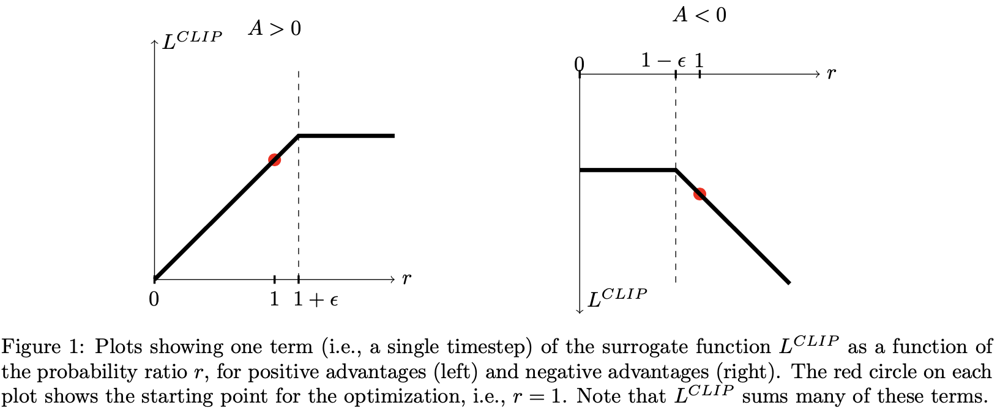
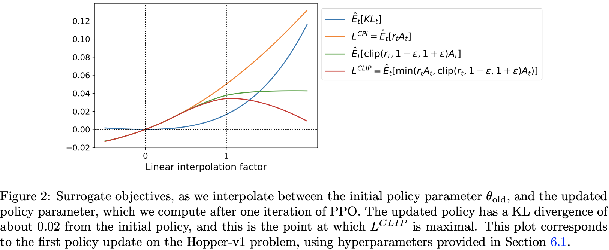

## [A] Proximal Policy Optimization Algorithms
> 2017 - arXiv - OpenAI  
> Author: John Schulman, Filip Wolski, Prafulla Dhariwal, Alec Radford, Oleg Klimov  
> Link: [原文链接](https://arxiv.org/abs/1707.06347)

### Abstract

我们提出了一种用于强化学习的策略梯度类的方法，该方法表现为通过与环境交互来sample datas和借助 *stochastic gradient ascent* 来优化一个“surrogate”目标函数，两者之间交替执行。 
与每采样一次数据就进行一次梯度更新的standard策略梯度方法不同，我们提出了一种新颖的目标函数，可以实现多个epochs的小批量更新。
这个新方法我们把它称为**近端策略优化**（proximal policy optimization, ppo），该方法拥有置信域策略优化（TRPO）的部分优势，但是该方法有具有比TRPO更易实现、更一般化、以及更优的样本复杂性的优点。
我们在一组benchmark的任务中测试了PPO算法，包括仿真机器人运动（simulated robotic locomotion）和Atari游戏，实验结果表明PPO比其他在线策略梯度表现的都要好，总体上在样本的复杂性、简易性以及有效性之间达到了一个有效的平衡。

### Introduction

近年来，一些基于神经网络函数逼近的强化学习方法被提出，其中最具影响力的是 *deep Q-learning*、*vanilla policy gradient* 以及 *trust region policy gradient*。
然而这些方法在scalable（大型模型和并行实现）、数据效率以及健壮性（在不进行超参数调优的情况下）方面还有提升的空间。
Q-learning（基于函数逼近）在很多简单的问题上表现不佳，且可解释性较差；
vanilla policy gradient方法在数据效率和健壮性上表现不足；
而TRPO方法则相对来说比较复杂，且与包含noise（比如dropout）或者参数共享（策略与值函数或者辅助任务之间）的架构不兼容。  

本文试图通过引入一种算法来改善目前的状况，该算法在仅使用一阶优化的情况下拥有高的数据效率和TRPO的可靠表现。
我们提出了一个基于`clipped probability ratios`的新式目标，它表示的是策略性能的“pessimistic”的估计（即下界）。
为了优化策略，我们交替的执行基于策略进行采样和在采样的数据上进行几个epochs的优化。

我们实验比较了多种不同形式的 **surrogate objective** 的表现，发现objective为 **clipped probability ratios** 形式时表现最佳。
我们也将PPO算法和先前的几种文献中的算法进行了比较。
在连续控制任务中，PPO算法比这些算法表现的都要好；在Atari游戏中，PPO算法明显比A2C算法表现的要好（就样本复杂度而言），与ACER表现相似，但是PPO更加简单。

### Background: Policy Optimization
#### Policy Gradient Methods

Policy gradient 方法的工作机制为：计算一个policy gradient的估计值，然后插入到梯度上升算法中。
最常用的梯度估计的形式为：
$$
\begin{align}
\hat{g} = \hat{\mathbb{E}}_t [\nabla_{\theta} log \pi_{\theta}(a_t|s_t) \hat{A}_t] \tag{1}
\end{align}
$$
其中，$\pi_\theta$ 是一个随机策略，$\hat{A}_t$ 是t时刻优势函数的估计值。
这里的期望 $\hat{\mathbb{E}}_t[...]$ 表示的是在一个采样和优化交替进行的算法中，有限样本集的经验平均值。
通过构造一个梯度为策略梯度估计的目标函数以自动微分软件来实现梯度的求解；估计值 $\hat{g}$ 通过微分下面的目标函数得到：
$$
\begin{align}
L^{PG}(\theta) = \hat{\mathbb{E}}_t[log \pi_\theta(a_t|s_t)\hat{A}_t] \tag{2}
\end{align}
$$
然而不能使用相同的trajectory来对 $L^{PG}$ 损失执行多个时间步的优化，因为这常常会导致过大的策略更新（虽然该设置在6.1节中没有展示出来，但是它的结果与“no clipping or penalty”的设置是相似的）。

### Trust Region Methods

TRPO是在约束策略更新大小的情况下最大化目标函数（“surrogate”目标）。
$$
\begin{align}
\mathop{maximize}\limits_{\theta} \quad \hat{\mathbb{E}}_t [\frac{\pi_{\theta}(a_t|s_t)}{\pi_{\theta_{old}}(a_t|s_t)} \hat{A}_t] \tag{3}
\end{align}
$$

$$
\begin{align}
subject\ to\ \quad \hat{\mathbb{E}}_t[KL[\pi_{\theta_{old}}(\cdot|s_t), \pi_{\theta}(\cdot|s_t)]] \leq \delta \tag{4}
\end{align}
$$
其中，$\theta_{old}$ 表示的是更新之前的策略参数向量。在对目标做线性近似以及对约束做二次约束之后，该优化问题可以通过 *共轭梯度算法* 被有效地近似解决。

该理论证明TRPO实际上建议使用一个惩罚而不是约束，也就是，在一些系数 $\beta$ 优化下面这个无约束的优化问题：
$$
\begin{align}
\mathop{maximize}\limits_{\theta} \quad \hat{\mathbb{E}}_t [\frac{\pi_{\theta}(a_t|s_t)}{\pi_{\theta_{old}}(a_t|s_t)} \hat{A}_t - \beta KL[\pi_{\theta_{old}}(\cdot|s_t), \pi_{\theta}(\cdot|s_t)]] \tag{5}
\end{align}
$$
这遵循这样一个事实：一个确定的surrogate的目标（在状态上计算最大KL散度而不是求均值KL）在策略 $\pi$ 的性能上表现为一个下界（即pessimistic bound）。
然而，TRPO使用的是一个“hard”约束而不是惩罚，这是因为很难选择一个在不同问题上都表现很好的单个 $\beta$ 值，甚至是在这样的单一问题上：在学习上造成的特征改变，都无法找到一个有效的固定值。
因此，为了实现我们的目标，我们设计了一种模型TRPO单调提升的一阶算法，实验表明选择一个固定的惩罚系数 $\beta$ 以及使用SGD算法优化带惩罚的目标（方程5）是困难的。

### Clipped Surrogate Objective

特别地，让 $r_t(\theta)$ 表示 **probability ratio** $r_t(\theta) = \frac{\pi_{\theta}(a_t|s_t)}{\pi_{\theta_{old}}(a_t|s_t)}$，则有 $r(\theta_{old}) = 1$。TRPO最大化 *surrogate objective* 表示为：
$$
\begin{align}
L^{CPI}(\theta) = \hat{\mathbb{E}}_t [\frac{\pi_{\theta}(a_t|s_t)}{\pi_{\theta_{old}}(a_t|s_t)} \hat{A}_t] = \hat{\mathbb{E}}_t [r_t(\theta) \hat{A}_t] \tag{6}
\end{align}
$$
上标 *CPI* 指的是 **conservation policy iteration**（保守策略迭代）。
在最大化 $L^{CPI}$ 目标函数时，如果不加以约束将会导致过大的策略更新；因此，我们现在考虑如何修改这个目标函数，以惩罚策略的改变，使得 $r_t(\theta)$ 远离1。

我们提出的目标函数为：
$$
\begin{align}
L^{CLIP}(\theta) = \hat{\mathbb{E}}_t [min(r_t(\theta) \hat{A}_t, clip(r_t(\theta), 1 - \epsilon, 1 + \epsilon) \hat{A}_t)] \tag{7}
\end{align}
$$
其中，$\epsilon$ 是一个超参数（$\epsilon = 0.2$）。
目标函数 $L^{CLIP}(\theta)$（方程7）的解释为：*min* 内部的第一项其实就是 $L^{CPI}$， 第二项通过截断probability ratio修改这个surrogate目标。
这意味着移除区间 $[1 - \epsilon, 1 + \epsilon]$ 之外的 $r_t$ 的值对目标函数的影响。
最后，我们对 “clipped” 和 “unclipped”的目标取最小值，所以这最后的目标是 “unclipped” 目标的一个下界（即 pessimistic bound）。
因此，在这样的理论下，我们仅仅当 $r_t$ 可以提升目标时才会忽略 $r_t$ 的改变；当 $r_t$ 使得目标函数变差时，加入 $r_t$ 的改变。
（**译者注：即只有当新旧策略的比值能够提升目标函数时，才会不进行clip的操作，否则进行clip的操作以使得目标函数不会变差，达到单调提升的效果**）。
值得注意的是，当 $\theta = \theta_{old}$ 时（即 $r = 1$），$L^{CLIP}(\theta) = L^{CPI}(\theta)$。
然而，它们随着 $\theta$ 逐渐远离 $\theta_{old}$ 而变得不同。
图1画出了在时间t时 $L^{CLIP}$ 的变化；注意到当优势值为正或负时， *probability ratio* 在点 $1 - \epsilon$ 或点 $1 + \epsilon$ 处被相应的截断。

图2提供了另一种关于 *surrogate objective* $L^{CLIP}$ 的直观理解。
它展示了当我们在一个连续控制问题中沿着由PPO算法获得的策略更新方向插值（interpolate）时，几种目标函数是如何变化的。
我们可以看到对过大的策略更新施加惩罚的目标函数 $L^{CLIP}$ 是 $L^{CPI}$ 的一个 *lower bound*。

### Adaptive KL Penalty Coefficient

除此之外，另一种可以用作替代clipped surrogate目标的方法是对KL散度使用惩罚，为了对惩罚系数进行自适应，我们需要在每次策略更新时获取一些KL散度 $d_{targ}$ 的目标值。
然而，在实验中，我们发现：KL惩罚比clipped surrogate目标表现的要差，但是我们仍然在实验中添加了这组实验，这是因为它将会是一个重要的baselines。

在这个算法的最简单的实例中，我们依据下面的步骤来进行每次的策略更新：
-  执行几个epoches的小批量随机梯度下降（minibatch SGD），优化带KL惩罚的目标函数
$$
\begin{align}
L^{KLPEN}(\theta) = \hat{\mathbb{E}}_t [\frac{\pi_\theta(a_t|s_t)}{\pi_{\theta_{old}}(a_t|s_t)} \hat{A}_t - \beta KL [\pi_{\theta_{old}}(\cdot|s_t), \pi_\theta(\cdot|s_t)]] \tag{8}
\end{align}
$$

- 计算 
$$
\begin{align}
d = \hat{\mathbb{E}}_t [KL [\pi_{\theta_{old}}(\cdot|s_t), \pi_\theta(\cdot|s_t)]]
\end{align}
$$
    * If $d < d_{targ} / 1.5$, $\beta \leftarrow \beta / 2$  
    * If $d > d_{targ} \times 1.5$, $\beta \leftarrow \beta \times 2$  

更新了的惩罚系数 $\beta$ 在下次策略更新时使用。
然而，可以想像，按照这种方法更新策略的方法，我们只有在KL散度与 $d_{targ}$ 差别很大时才会看到策略更新，这种情况时很少的，而且系数 $\beta$ 也会很快适应这种情况（**译者注：也就是说，按照这种目标函数更新策略时，策略更新的次数会很少，且就算发生了这种情况，惩罚系数也会很快的适应，这又将导致策略不再更新，直到下一次出现该情况**）。

### Algorithm
*Surrogate loss* 根据前面的章节可以被计算出来，与经典的策略梯度实现有一些小的改变。
为了使用自动微分实现，一个简单的结构是使用 $L^{CLIP}$ 或者 $L^{KLPEN}$ 代替 $L^{PG}$，并且在这个目标上来执行多步的随机梯度上升。

很多计算低方差的优势函数估计技术都使用了一个学习到的状态值函数 $V(s)$；例如，一般优势估计（generalized advantage estimation）、finite-horizon estimators。
如果使用一个在策略和值函数之间共享参数的神经网络结构，我们必须使用一个组合了 **policy surrogate** 和 **value function error** 项的 **loss function**。
这个目标可以通过增加一个熵项来进一步被强化以确保足够的探索。
整合这些项，我们可以得到下面这样一个目标函数，它在每一次迭代中都被（近似）最大化：
$$
\begin{align}
L_t^{CLIP + VF + S}(\theta) = \hat{\mathbb{E}}_t [L_t^{CLIP}(\theta) - c_1 L_t^{VF}(\theta) + c_2 S[\pi_\theta](s_t)] \tag{9}
\end{align}
$$
其中，$c_1, c_2$ 是系数，$S$ 表示一个熵项，$L_t^{VF}$ 是一个平方差损失 $(V_\theta(s_t) - V_t^{targ})^2$。

一种适合使用RNN（Recurrent Neural network）的策略梯度实现的方式是，在 $T$ 个时间步上执行这个策略（其中 $T$ 必须远小于episode的长度），然后用收集到的样本进行一次更新。
这种形式的更新要求一个不能超过时间步 $T$ 的优势估计。这种估计形式为：
$$
\begin{align}
\hat{A}_t = -V(s_t) + r_t + \gamma r_{t+1} + \cdots + \gamma^{T-t+1} r_{T-1} + \gamma^{T-t} V(s_T) \tag{10}
\end{align}
$$
其中，$t \in [0,T]$ 为在一个给定的长度为 $T$ 的轨迹段的时间索引。
我们在应用这个改变时，使用了一个 *generalized advantage estimation* 的截断版本，当 $\lambda = 1$ 时，变为方程(10)：
$$
\begin{align}
\hat{A}_t = \delta_t + (\gamma \lambda)\delta_{t+1} + \cdots + (\gamma \lambda)^{T-t+1}\delta_{T-1} \tag{11}
\end{align}
$$
$$
\begin{align} 
其中, \delta_t = r_t + \gamma V(s_{t+1}) - V(s_t) \tag{12}
\end{align}
$$

一个使用固定长度的轨迹段的PPO算法在下面展示出来了。

**------------------------------------------------------------------------------------------------------**     
**Algorithm 1** PPO, Actor-Critic Style  
**------------------------------------------------------------------------------------------------------**    
&emsp; **for** iteration = 1, 2, ... do  
&emsp;&emsp;&emsp; **for** actor = 1, 2, ..., $N$ do  
&emsp;&emsp;&emsp;&emsp;&emsp; Run policy $\pi_{\theta_{old}}$ in environment for $T$ timesteps  
&emsp;&emsp;&emsp;&emsp;&emsp; Compute advantage estimates $$\hat{A}_1, ..., \hat{A}_T$$  
&emsp;&emsp;&emsp; **end for**  
&emsp;&emsp;&emsp; Optimize surrogate $L$ wrt $\theta$, with $K$ epochs and minibatch size $M \leq NT$  
&emsp;&emsp;&emsp; $\theta_{old} \leftarrow \theta$    
&emsp; **end for**  
**------------------------------------------------------------------------------------------------------**   

每一次迭代，$N$（并行）个actors中的每一个都收集 $T$ 个时间步的数据。
然后我们在 $NT$ 个时间步的数据上构建 *surrogate loss*，然后通过SGD（或者是Adam）算法来执行 $K$ 个epochs的优化。

### Experiments
#### Comparison of Surrogate Objective

首先，我们在不同的超参数下比较几种不同的surrogate目标。
这里，我们将surrogate目标 $L^{CLIP}$ 和几种 *natiral variations* 、*ablated version* 进行比较。
$$
\begin{align}
No\ clipping\ or\ penalty:\ \qquad L_t(\theta) &= r_t(\theta)\hat{A}_t \tag{12}
\end{align}
$$
$$
\begin{align}
Clipping:\ \qquad  L_t(\theta) &= min(r_t(\theta)\hat{A}_t, clip(r_t(\theta), 1 - \epsilon, 1 + \epsilon)\hat{A}_t) \tag{13}
\end{align}
$$
$$
\begin{align}
KL\ penalty\ (fixed\ or\ adaptive): \qquad L_t(\theta) = r_t(\theta)\hat{A}_t - \beta KL[\pi_{\theta_{old}}, \pi_\theta] \tag{14}
\end{align}
$$
对KL惩罚可以使用一个固定的惩罚系数 $\beta$ 或者一个自适应的系数（就如第四节描述的那样使用目标KL值）。
值得注意的是，我们也尝试在log空间中clipping，但是发现其效果并不理想。

为了表示策略，我们使用了一个全连接的MLP网络，其包含两个隐藏层，每个隐藏层包含64个神经元，每个神经元的激活函数为tanh非线性函数，输出高斯分布的均值和可变标准差。
**我们没有在策略和值函数之间共享参数（所以，系数 $c_1$ 就不那么重要了）**，也没有使用 *entopy bonus*。

### Conclusion

我们介绍了一个策略优化类的方法 -- PPO算法，它在每一次策略更新时执行多个epochs的梯度上升。该方法拥有置信域方法的可靠性和稳定性，却比置信域方法更易于实现，仅仅修改vanilla策略梯度的几行代码就可以实现，可以应用于更一般的场景中，以及拥有更优的性能表现。

