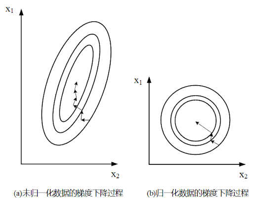

## 100+ Interview Questions for Algorithm Engineer
> 内容来源于 **葫芦娃** 编著的 **百面机器学习**  

### 01. 特征归一化
> `目的`：为了消除数据特征之间的量纲影响，我们需要对特征进行归一化处理，**使得不同指标之间具有可比性**。  
> `栗子`：例如，分析一个人的身高和体重对健康的影响，如果使用米（m）和千克（kg）作为单位，那么身高特征会在 $1.6 \sim 1.8 m$ 的数值范围内，
> 体重特征会在 $50 \sim 100 kg$ 的返回内，这样 **分析出来的结果显然会倾向于数值差别比较大的体重特征**。  
> `方法`：如果想要得到更为准确的结果，就需要进行 **特征归一化（Normalization）** 处理，使各指标处于同一数值量级，以便分析。

#### 为什么需要对数值类型的特征做归一化？
> 直观地，对数值类型的特征做归一化可以避免出现模型有偏的情况，使得各个特征之间可以相互比较、组合，得到更精准的、更值得信任的模型。

我们不妨借助随机梯度下降的实例来说明归一化的重要性。
假设有两种数值类型的特征，$x_1$ 的取值范围为 $[0, 10]$，$x_2$ 的取值范围为 $[0, 3]$，
于是可以构造一个目标函数符合图1.1(a)中的等值图。

在学习速率相同的情况下，$x_1$ 的更新速度会大于 $x_2$，需要较多的迭代才能找到最优解。
如果将 $x_1$ 和 $x_2$ 归一化到相同的数值区间后，优化目标的等值图会变成图1.1(b)中的圆形，$x_1$ 和 $x_2$ 的更新速度变的更为一致，容易更快地通过梯度下降找到最优解。

图1.1 数据归一化对梯度下降收敛速度产生的影响

当然，数据归一化并不是万能的。
在实际应用中，通过梯度下降法求解的模型通常是需要归一化的，包括线性回归、逻辑回归、支持向量机、神经网络等模型。
但对于决策模型并不适用，以C4.5为例，决策树在进行节点分裂时主要依据数据集 $D$ 关于特征 $x$ 的信息增益比，而信息增益比跟特征是否经过归一化是无关的，因为归一化并不会改变样本在特征 $x$ 上的信息增益。

#### 特征归一化的方法
> 对数值类型的特征做归一化可以将所有的特征都统一到一个大致相同的数值区间内

最常用的归一化方法主要有以下两种：  
- 线性函数归一化（Min-Max Scaling）：它对原始数据进行线性变换，使结果映射到 $[0, 1]$ 的范围，实现对原始数据的等比例缩放。数学表达式如下，

$$
\begin{align}
X_{norm} = \frac{X - X_{min}}{X_{max} - X_{min}} \tag{1.1}
\end{align}
$$

&emsp;&emsp;&ensp;&nbsp; 其中 $X$ 为原始数据，$X_{max}、X_{min}$ 分别为原始数据中的最大值和最小值。

- 零均值归一化（Z-Score Normalization）：它会将原始数据映射到均值为0、标准差为1的正太分布上。具体来说，假设原始特征的均值为 $\mu$、标准差为 $\sigma$，那么归一化的数学表达式为：

$$
\begin{align}
z = \frac{x - \mu}{\sigma} \tag{1.2}
\end{align}
$$

### 类别型特征
> `定义`：类别型特征主要是指性别（男、女）、血型（A、B、AB、O）等只在有限选项内取值的特征。  
> 类别型特征原始输入通常是字符串形式，除了决策树等少数模型能直接处理字符串形式的输入，对于逻辑回归、支持向量机等模型来说，类别型特征必须经过处理转换成数值型特征才能正确工作。

#### 在对数据进行预处理时，应该怎样处理类别型特征？
- 序号编码  
序号编码（Ordinal Encoding）通常用于处理类别间具有大小关系的数据。
例如成绩，可以分为低、中、高三档，并且存在“高 > 中 > 低”的排序关系。
序号编码会按照大小关系对类别特征赋予一个数值 **ID**，例如高表示为3、中表示为2、低表示为1，转换后依然保留了大小关系。

- 独热编码  
独热编码
