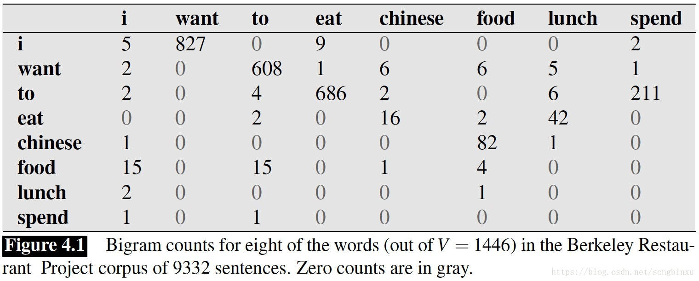

转载自[知乎](https://zhuanlan.zhihu.com/p/32829048)

## 自然语言处理中的n-gram模型
### 什么是n-gram？
> n-gram是一种用来将文本表示成数值型特征的工具。
> 正如这篇知乎中提到的：经过筛选后的gram列表就是这个文本的特征向量空间，列表中的每一种gram就是一个特征向量维度。

n-gram是一种基于统计语言模型的算法，它的基本思想是 **将文本中的内容按照字节进行大小为n的滑动窗口进行操作，形成一定数量的长度为n的字节片段序列。**

每一个字节片段称为一个gram，对所有gram出现的频率进行统计，并按事先设定好的阈值进行过滤，形成关键gram的列表，即这个文本的特征向量空间，且列表中的每一种gram就是一个特征向量维度。

该模型基于这样一种假设：**第n个词的出现只与前面的n-1个词有关，与其他词无关**。
这样整句的概率就是各个词出现的频率的乘积。
这些概率可以通过直接从语料库中统计n个词同时出现的次数得到。

### n-gram模型的数学表达
> n-gram模型之所以能够被广泛使用就是因为它基于“第i个词的出现只与前面的n-1个词有关，与其他词无关”这样的一种假设。

假定我们有一个由m个词组成的序列，我们希望计算这个序列出现的概率为多少，自然地，我们有

$$
\begin{align}
p(w_1, w_2, \cdots, w_m) = p(w_1) \cdot p(w_2|w_1) \cdot p(w_3|w_1, w_2) \cdot \cdots \cdot p(w_m|w_1, w_2, \cdots, w_{m-1}) \tag{1}
\end{align}
$$

显然，第i词的出现都依赖于前面的i-1个词的出现，这种概率并不好计算，而且在现实中这也是不合理的，往往第i个词的出现仅仅依赖于最近的几个词，过于久远的词对当前词的影响已经很小了，甚至可以忽略不计。
于是，我们假设该序列具有马尔可夫行，是一条马尔可夫链，即第i个词的出现仅仅跟前面的n个词有关，因此有

$$
\begin{align}
p(w_1, w_2, \cdots, w_m) = \prod_{i=0}^{m} p(w_i|w_{i-n+1}, \cdots, w_{i-1}) \tag{2}
\end{align}
$$

特别地，一般常用的n-gram模型为unigram、bigram、trigram，它们的数学概率表达为

$$
\begin{align}
unigram\ :\ p(w_1, w_2, \cdots, w_m) &= \prod_{i=0}^{m} p(w_i) \tag{3} \\
bigram\ :\ p(w_1, w_2, \cdots, w_m) &= \prod_{i=0}^{m} p(w_i|w_{i-1}) \tag{4} \\
trigram\ :\ p(w_1, w_2, \cdots, w_m) &= \prod_{i=0}^{m} p(w_i|w_{i-1}, w_{i-2}) \tag{5}
\end{align}
$$

其中，$$p(w_i|w_{i-1}) = \frac{\mathop{count} (w_i, w_{i-1})}{\mathop{count} (w_{i-1})}$$ 。

### 举例说明ngram的概率计算
> 通过一个《Language Modeling with Ngrams》中的例子，来说明ngram的概率计算。

图1. 句子中各个词的词频统计

据统计，$p(I \mid <s>) = 0.25$ ，$p(<s> \mid food) = 0.68$ ，于是，对于句子 “< s > I want chinese food < s >” 的Bigram的概率为：

$$
\begin{align}
p(<s>\ I\ want\ chinese\ food\ <s>) = 0.25 \times 0.33 \times 0.0065 \times 0.52 \times 0.68 = 1.896 \times 10^{-4}
\end{align}
$$

这样我们计算出了“I want chinese food”这句话的bigram概率，但是可以发现由于概率都是大于0小于1的小数，而句子一般都会很长，这样就导致最终句子的概率会很小，造成数据下溢，
即多个大于0小于1的常数相乘约等于0。对于这种情况，可以使用$log$概率来解决。

### n-gram的应用
> 在NLP中，基于一定的语料库，可以利用n-gram来评估一个句子是否合理；另外，n-gram也可以用来评估两个字符串之间的差异程度（模糊匹配）。

